Now that we have built our own model and uderstand the full lifecycle of an ML model, we can improve on the process. One factor that is often overlooked in machine learning is the experimentation factor. By changing which features (columns) we use from our dataset, tuning the hyperparameters of our training algorithms (changing the value of `n_estimators` in our random forest model for example), or even engineering new features (creating new features from existing features, `LOTAREA`*`BEDROOMABVGR` to create a new feature), we can potentially improve the accuracy of our models. As we saw in the example, the different algorithms perform at different levels of accuracy, and experimentation is incredibly important. 

But this is time consuming to do by hand! Here I will demonstrate how to utilize a tool called AutoAI to autmate a lot of this process. 

---

## Using AutoAI
Navigate to the project overview page and select **Add to project**, this time select **AutoAI experiment**
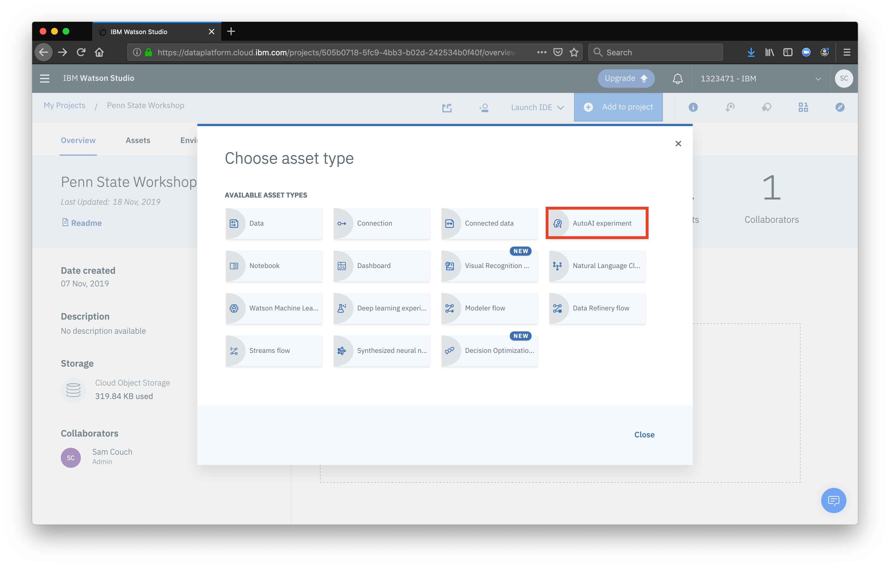
Next we need to add our Watson Machine Learning instance as a service for our project. Click **Associate a Watson Machine Learning service instance**
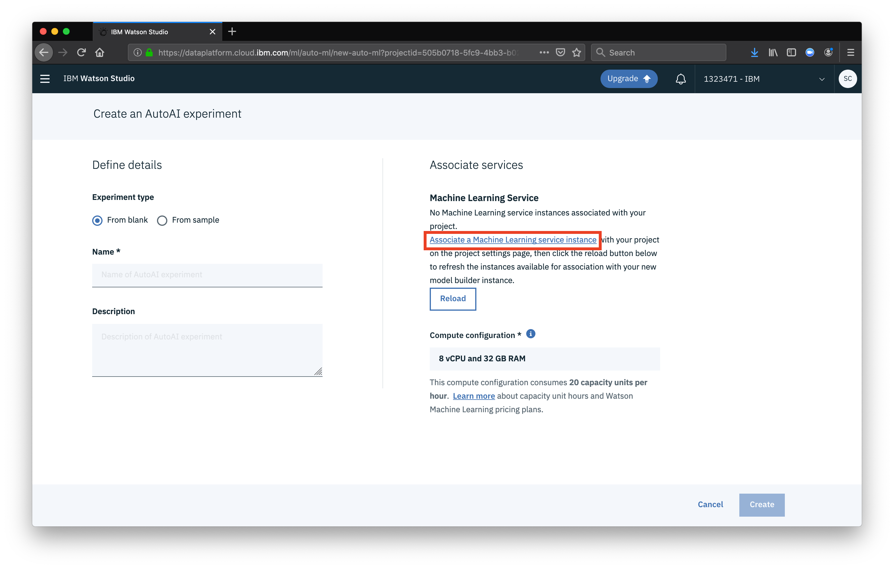
From this page, select your instance from the dropdown, them click **Select**
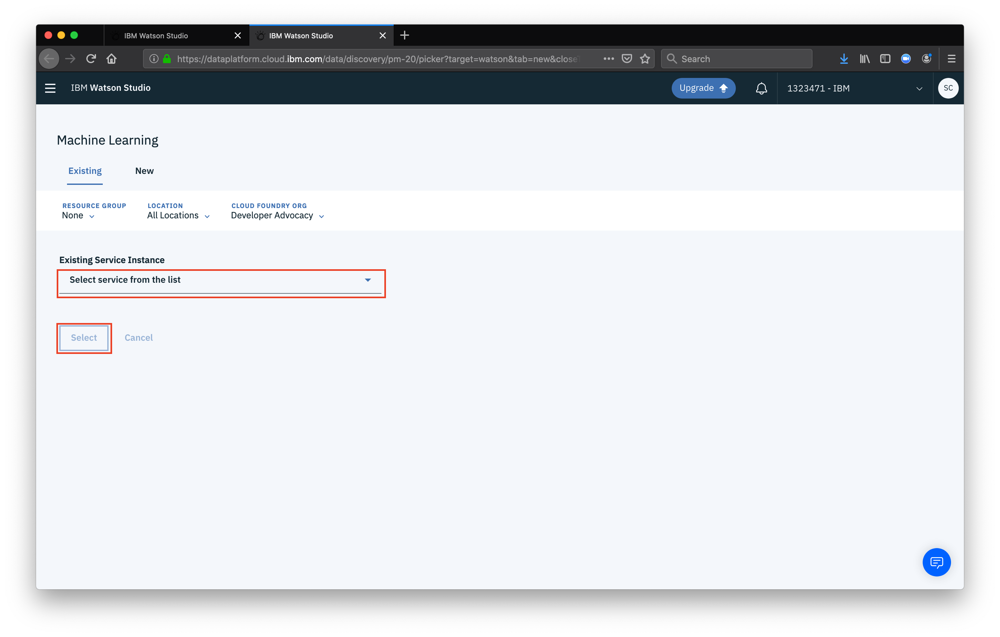
Once associated, click **Reload** to make sure the WML service is properly associated.

Finally give your AutoAI Experiment a name and click **Create**

Now we need to add a data source for our AutoAI exeriment. Click **Select from project** (or from file, if you want).

Make sure our data asset is checked and click **Select asset**
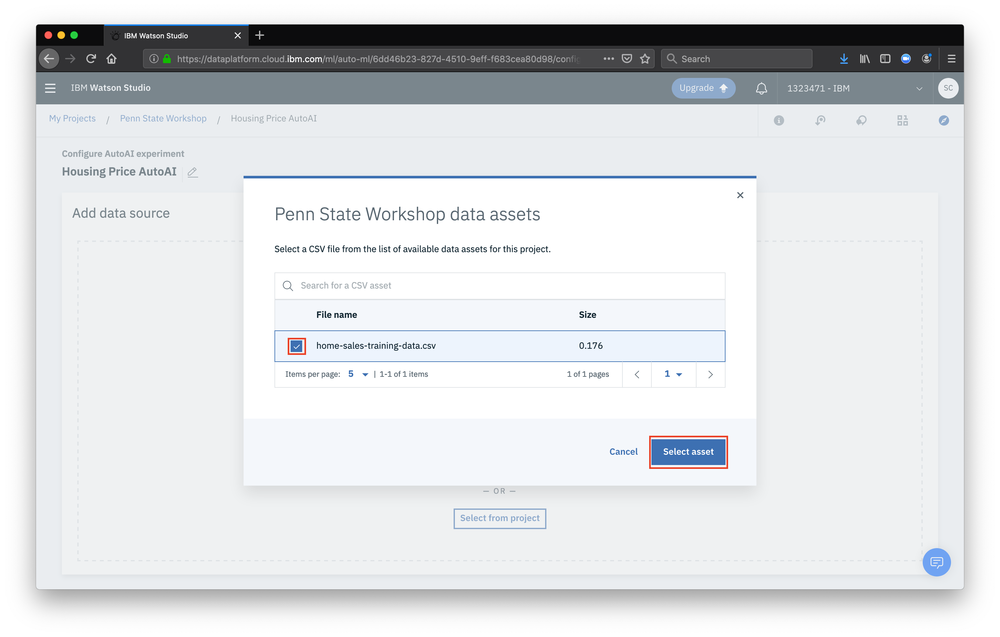
Now that our dataset is loaded, the first thing we want to do is select the feature (column) that we want to predict for, in this case `SALEPRICE` will be used. Once you select the prediction column, click **Experiment settings**
 
Feel free to explore some of the settings, the main thing we want to do is remove the `ID` column from being included in our model (since the `ID` doesn't tell us anything meaningful). Then click **Save settings**
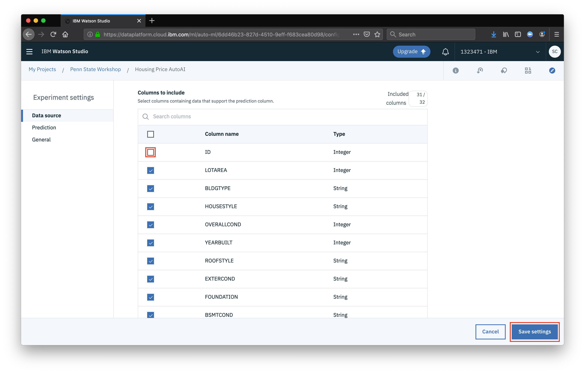
Now that everything is configured, click **Run experiment**
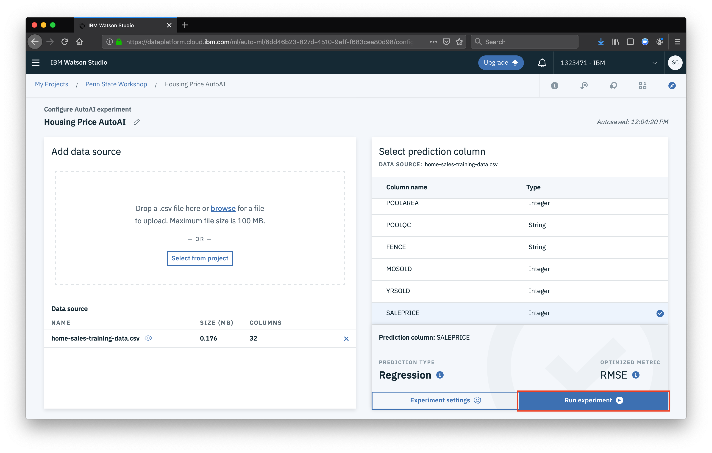
At this point our job has kicked off and the tool is running various experiments. Once it is completed, you will see it displayed as complete under the progress map. We can then look at the experiment results by clicking the **Pipeline comparison** tab
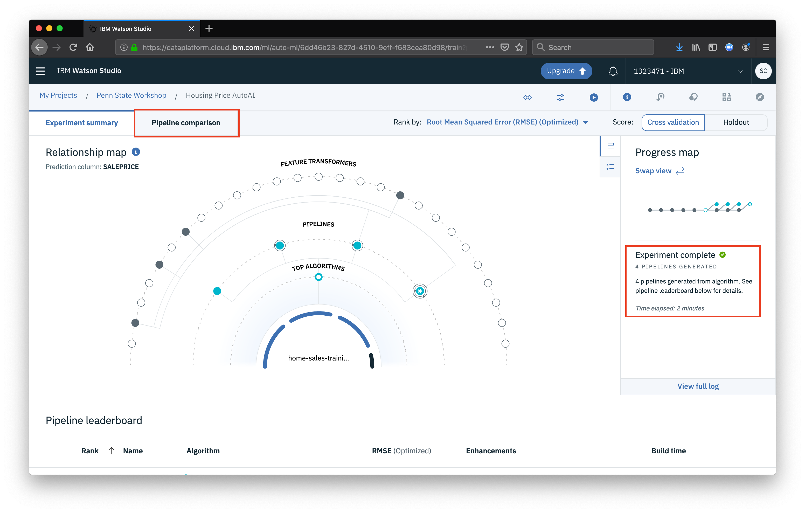
Each pipeline we can think of as an individual model, where we are testing an algorithm, with various parameters and features being used. The pipelines are ranked based on performance. You can select an indivudal pipeline to see more info about the model created. For now, let's look at the one that performed the best.
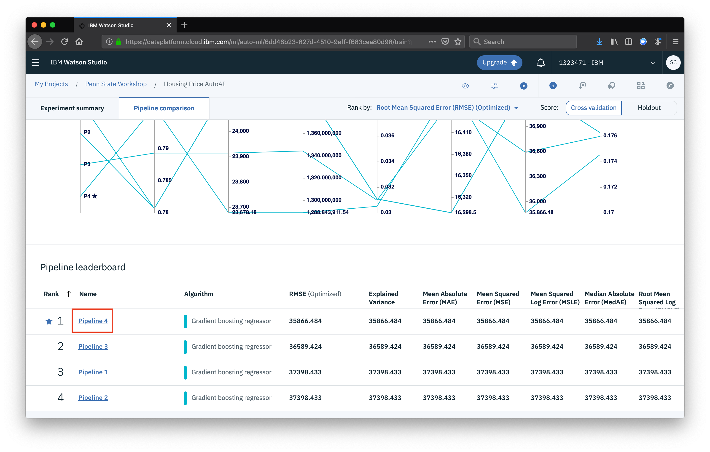
From the pipeline viewer we can see all sorts of information about the configuration used for the model as well as the evaluation measures. 

Once satisfied with a model, we can prepare to deploy it. First, select **Save as** then select **Model**
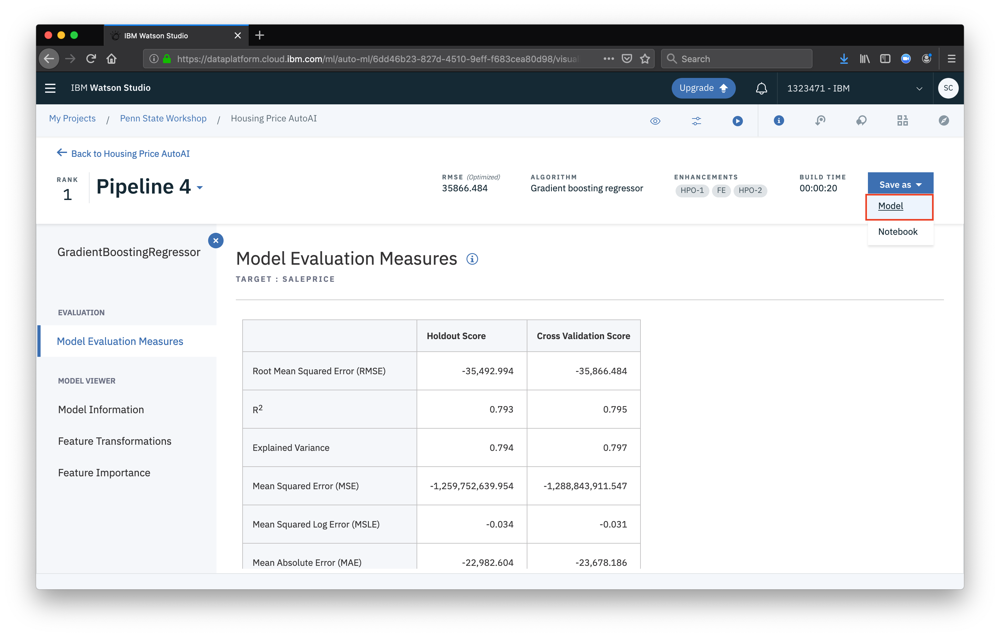
Now, navigate back to the project overview
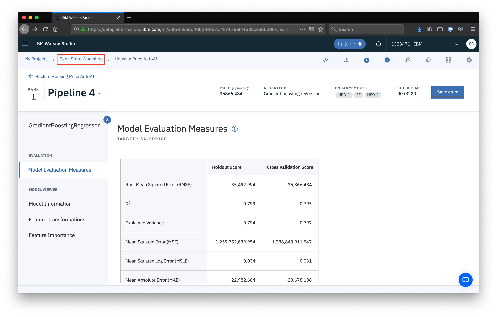
Go to the **Assets** tab and scroll down to the **Models** section

In the **Models** section, find the model created by AutoAI, click the *more* button (the three vertical dots) and click **Deploy**
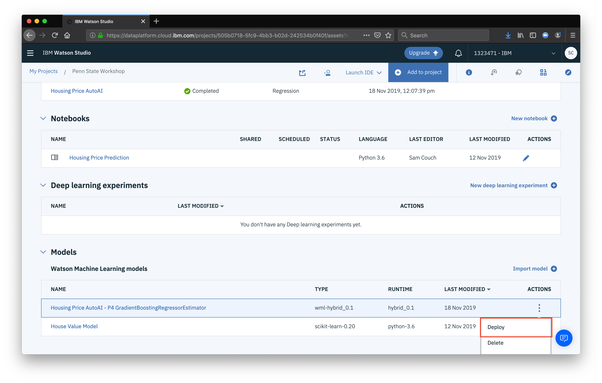
Next click **Add deployment**
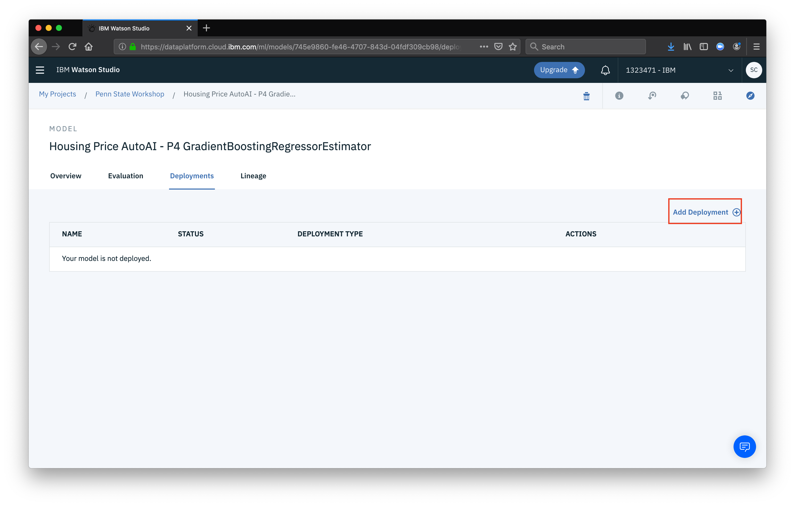
Give your deployment a name, ensure that **Web service** is selected and click **Save**
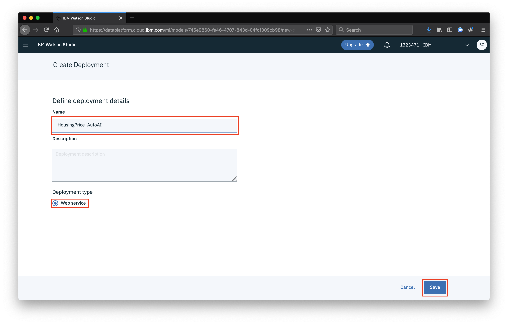
Once the deplpyment is done, the status will change to *ready* and we can click on the deployment name to see some details

Finally, we can test the model from the **Test** tab. You can test by either filling in the fields and clickinhg **Predict** or, change the input to *JSON* (by clicking the small document icon)

Now to use the model in an application, we can get the scoring URL by clicking the **Implementation** tab and copying the scoring endpoint
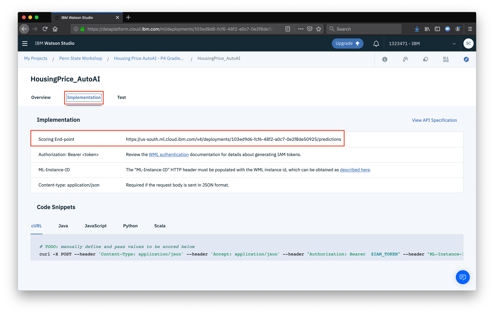

You can use the scoring endpoint just like any other Watson service or generic REST API. Clicking on the **API Specification** link will take you to more details on how to use your new API endpoint, including authentication details.