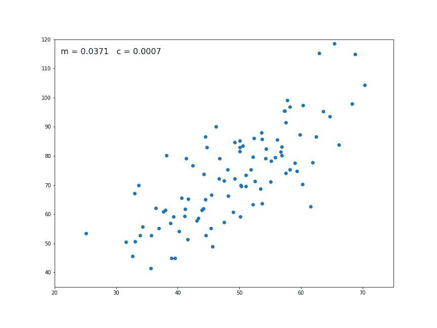
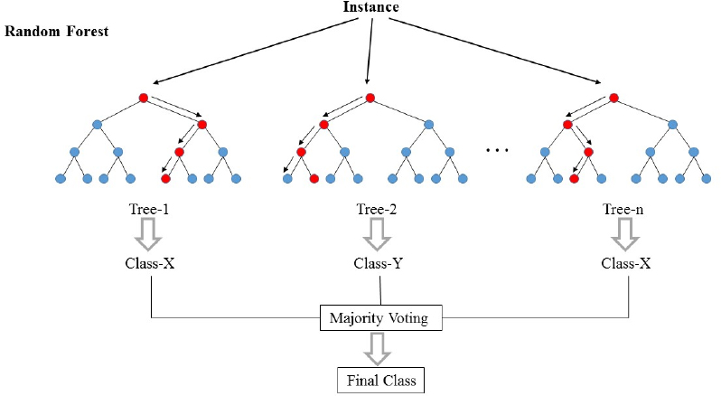

## Linear Regression

Linear regression is a predictive modeling apprach that takes all data points and represents them as a relationship of (`x`, `y`), where `x` is the independent variable (predictor) and `y` is the dependent variable (response). In our case, the various features of the dataset are the independent variables (roof type, number of bedrooms, etc.) and the sale price is the dependent variable (what we are trying to predict). The basic idea is to take all inputs and find the ***best*** (linear) line that fits the data (as the gif above demonstrates).

## Random Forest

Random Forest is a machine learning algorithm that works by building a "forest" of many decision trees (hence the name). The model generates `n` number of trees (based off our input `n_estimators`) where each decision tree generates a prediction (a vote) and the prediction that has the most number of votes from all decision trees becomes the final output. 

## Gradient boosting

Gradient boosting is somewhat similar to random forest in that it is also based on the concept of creating many decision trees; the primary difference however is that with gradient boosting, each tree learns and proves upon the previous.